<!--Copyright 2024 The HuggingFace Team. All rights reserved.

Licensed under the Apache License, Version 2.0 (the "License"); you may not use this file except in compliance with
the License. You may obtain a copy of the License at

http://www.apache.org/licenses/LICENSE-2.0

Unless required by applicable law or agreed to in writing, software distributed under the License is distributed on
an "AS IS" BASIS, WITHOUT WARRANTIES OR CONDITIONS OF ANY KIND, either express or implied. See the License for the
specific language governing permissions and limitations under the License.

⚠️ Note that this file is in Markdown but contain specific syntax for our doc-builder (similar to MDX) that may not be
rendered properly in your Markdown viewer.

-->

# Transformers Library Architecture

This document provides a comprehensive overview of the Transformers library architecture, including detailed diagrams showing the relationships between key components, data flows, and architectural patterns.

## Overview

The Hugging Face Transformers library is designed as a modular, extensible framework for working with transformer-based models. The architecture follows a layered approach with clear separation of concerns between configuration, modeling, preprocessing, and inference components.

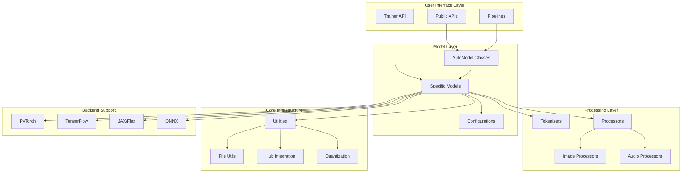

## Core Components Architecture

### Model Architecture

The model architecture is built around a hierarchy of base classes that provide common functionality while allowing for model-specific implementations.

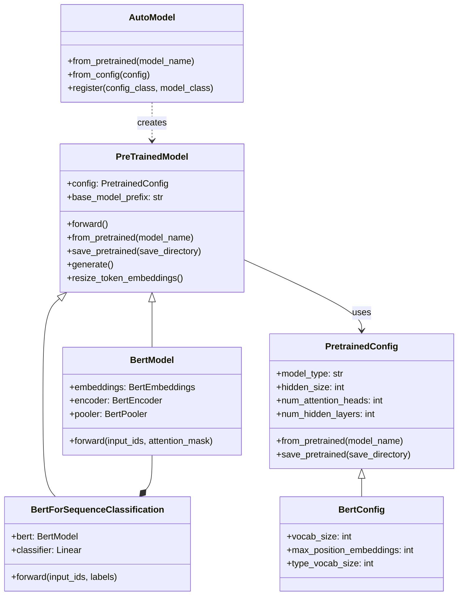

### Pipeline Architecture

Pipelines provide a high-level, task-oriented interface that abstracts away the complexity of model loading, preprocessing, and postprocessing.

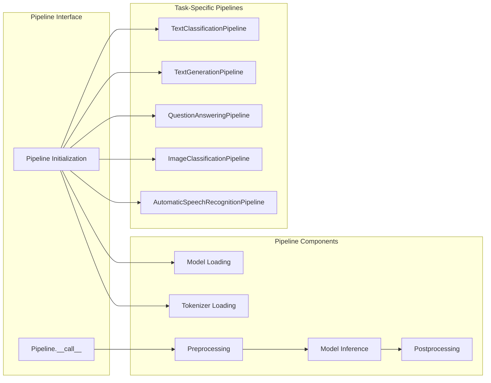

### Processing Architecture

The processing layer handles data transformation and normalization for different modalities.

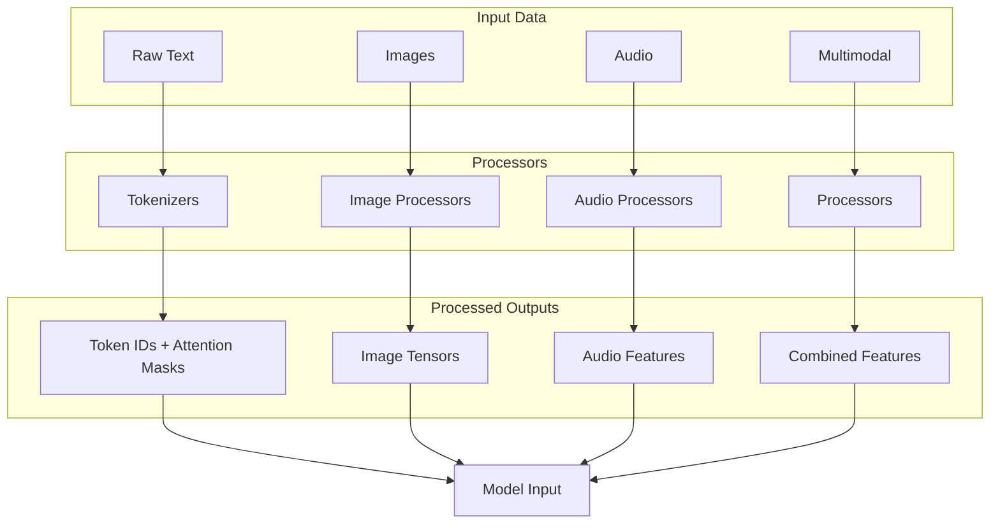

## Training Architecture

### Trainer Framework

The Trainer class provides a high-level training loop with support for distributed training, evaluation, and various optimization strategies.

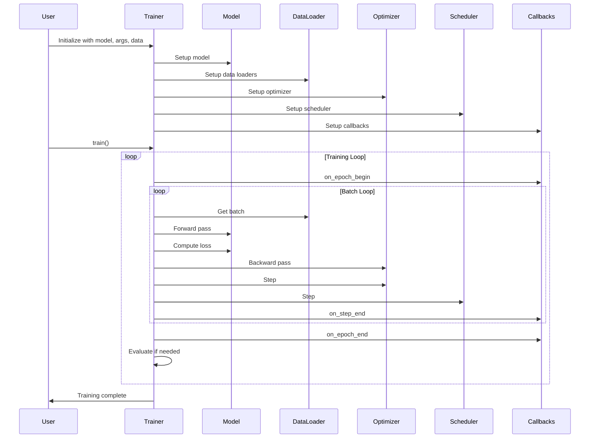

### Distributed Training Architecture

The library supports various distributed training strategies for scaling across multiple devices and nodes.

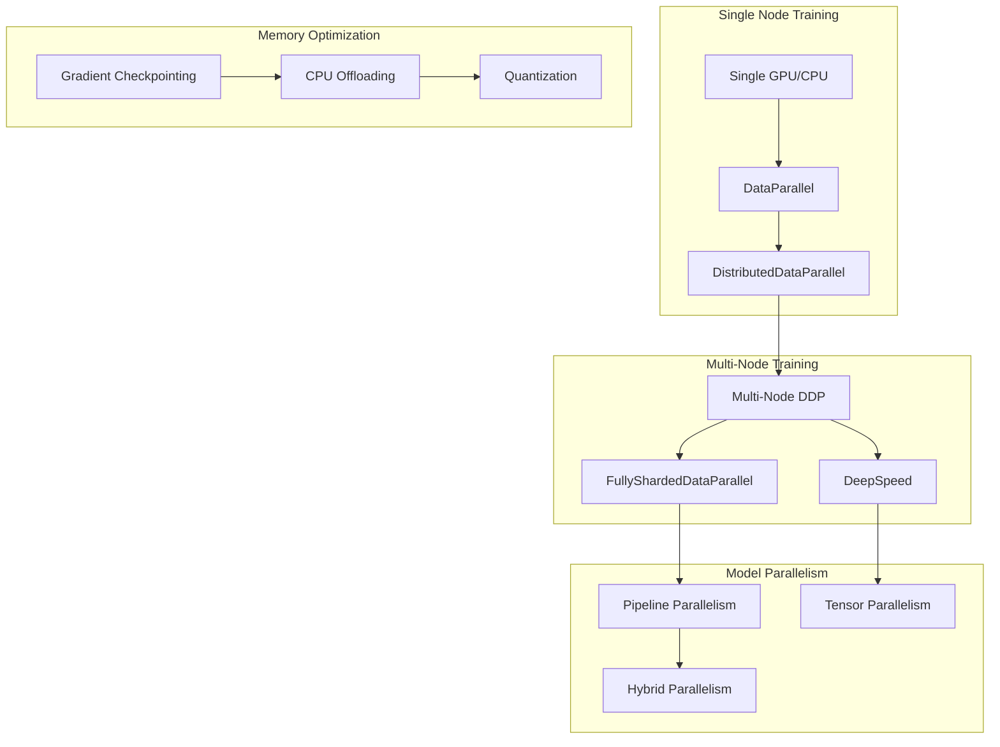

## AutoModel System

The AutoModel system provides automatic model loading based on configuration files, enabling seamless switching between different model architectures.

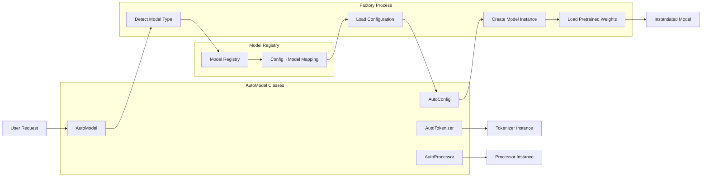

## Generation Architecture

Text generation in transformers involves sophisticated strategies for producing coherent and contextually appropriate text.

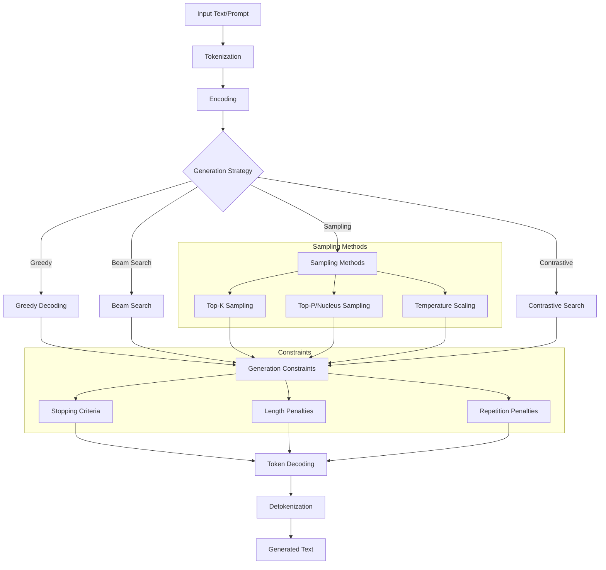

## Memory and Performance Optimization

The library includes various optimization strategies for memory efficiency and performance.

```mermaid
graph TB
    subgraph "Model Optimization"
        PRUNING[Model Pruning]
        DISTILLATION[Knowledge Distillation]
        COMPRESSION[Model Compression]
    end
    
    subgraph "Quantization Strategies"
        FP16[Half Precision (FP16)]
        BF16[Brain Float (BF16)]
        INT8[8-bit Quantization]
        INT4[4-bit Quantization]
        DYNAMIC[Dynamic Quantization]
    end
    
    subgraph "Memory Management"
        GRADIENT_CHECKPOINT[Gradient Checkpointing]
        ACTIVATION_CHECKPOINT[Activation Checkpointing]
        CPU_OFFLOAD[CPU Offloading]
        DISK_OFFLOAD[Disk Offloading]
    end
    
    subgraph "Inference Optimization"
        TORCH_COMPILE[torch.compile]
        ONNX_EXPORT[ONNX Export]
        TENSORRT[TensorRT Optimization]
        OPENVINO[OpenVINO Optimization]
    end
    
    PRUNING --> FP16
    DISTILLATION --> BF16
    COMPRESSION --> INT8
    
    FP16 --> GRADIENT_CHECKPOINT
    INT8 --> CPU_OFFLOAD
    INT4 --> DISK_OFFLOAD
    
    GRADIENT_CHECKPOINT --> TORCH_COMPILE
    CPU_OFFLOAD --> ONNX_EXPORT
    ACTIVATION_CHECKPOINT --> TENSORRT
    DISK_OFFLOAD --> OPENVINO
```

## Hub Integration Architecture

The integration with Hugging Face Hub provides seamless model sharing and collaboration capabilities.

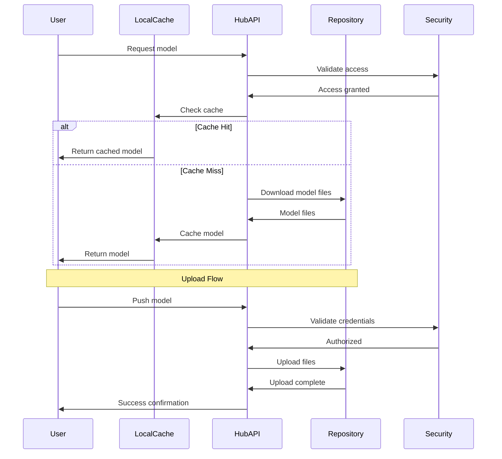

## Backend Support Architecture

The library supports multiple ML frameworks through a unified interface.

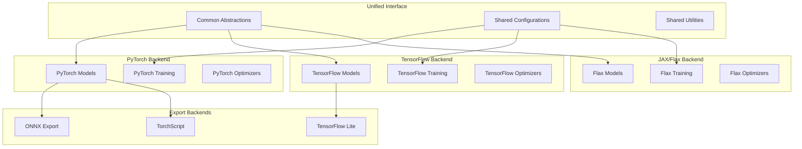

## Extension Points and Customization

The library provides multiple extension points for customization and adding new functionality.

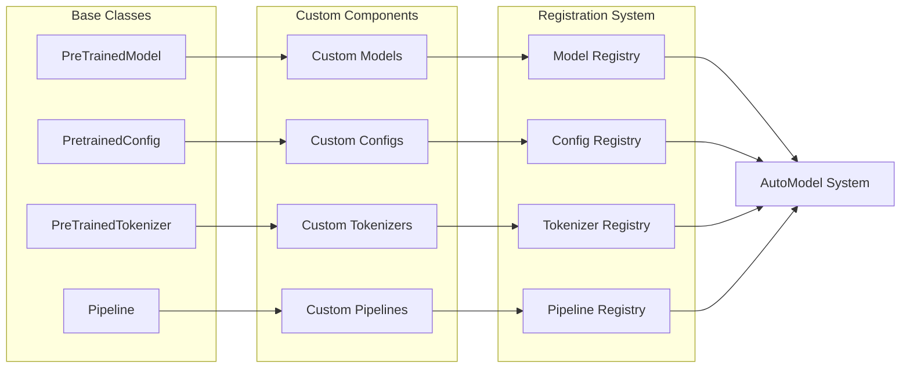

## Summary

The Transformers library architecture is designed with the following key principles:

1. **Modularity**: Clear separation between different components (models, processors, trainers)
2. **Extensibility**: Easy to add new models, tasks, and backends
3. **Unified Interface**: Consistent APIs across different backends and model types
4. **Performance**: Multiple optimization strategies for different deployment scenarios
5. **User-Friendly**: High-level APIs (Pipelines, Trainer) for common use cases
6. **Flexibility**: Low-level APIs for advanced customization

This architecture enables the library to serve both researchers who need fine-grained control and practitioners who want simple, production-ready solutions.