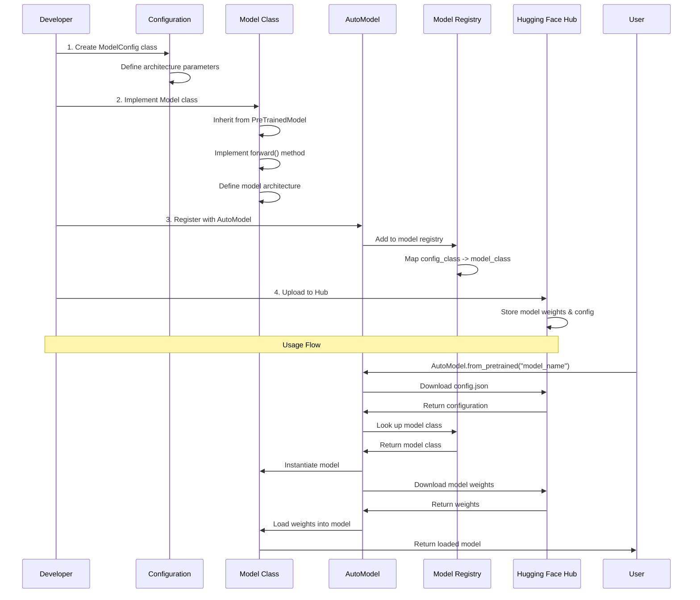
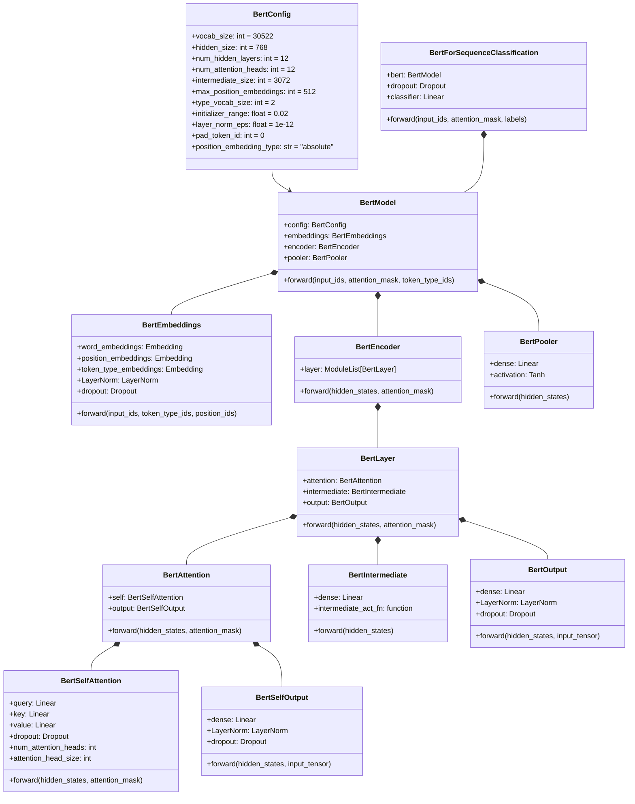
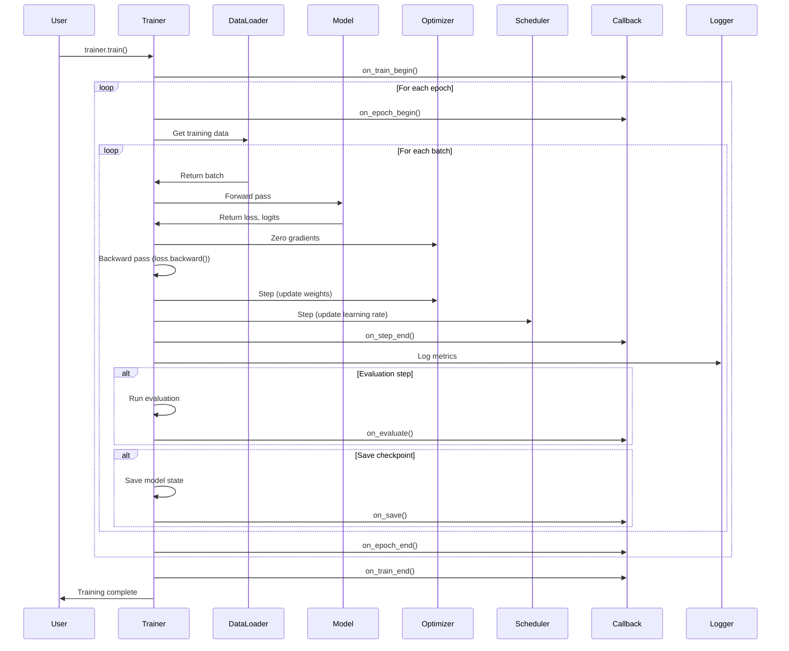
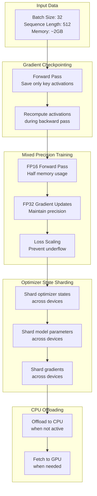
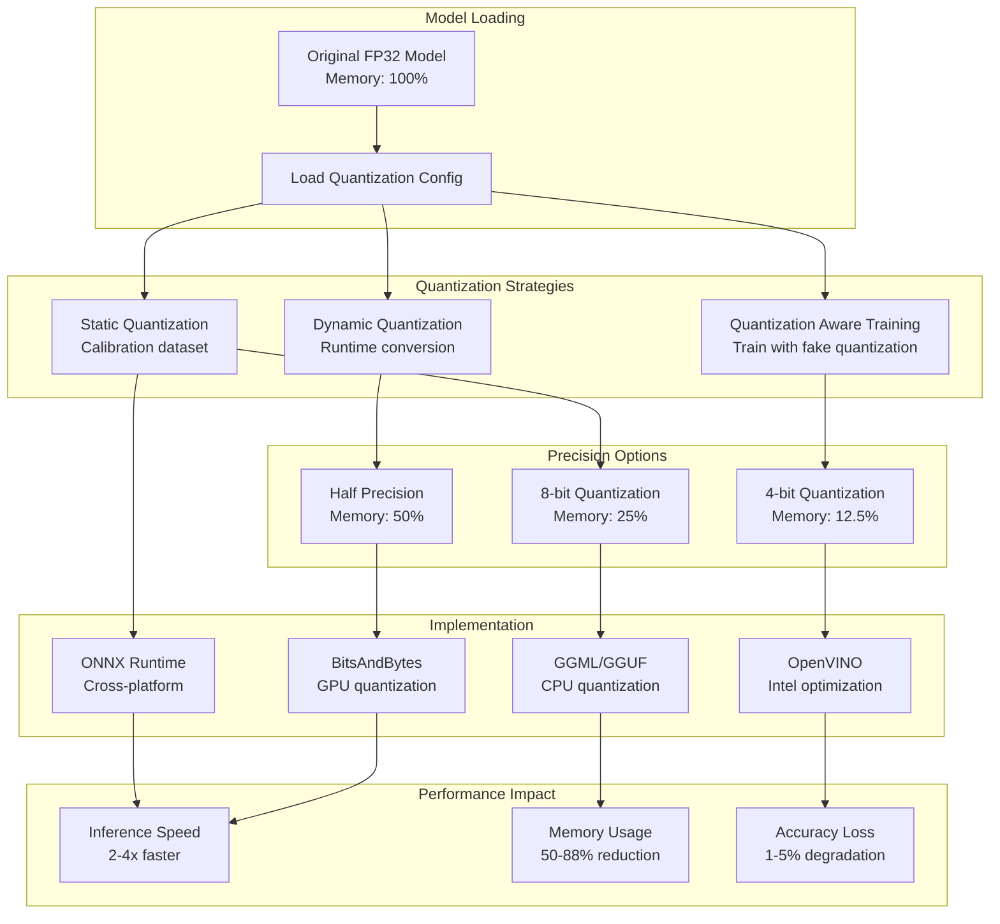

<!--Copyright 2024 The HuggingFace Team. All rights reserved.

Licensed under the Apache License, Version 2.0 (the "License"); you may not use this file except in compliance with
the License. You may obtain a copy of the License at

http://www.apache.org/licenses/LICENSE-2.0

Unless required by applicable law or agreed to in writing, software distributed under the License is distributed on
an "AS IS" BASIS, WITHOUT WARRANTIES OR CONDITIONS OF ANY KIND, either express or implied. See the License for the
specific language governing permissions and limitations under the License.

⚠️ Note that this file is in Markdown but contain specific syntax for our doc-builder (similar to MDX) that may not be
rendered properly in your Markdown viewer.

-->

# Model Implementation Patterns

This document provides detailed examples of how the architectural patterns described in the [Library Architecture](./architecture) are implemented in practice, with concrete code flows and implementation details.

## Model Implementation Flow

This diagram shows the typical flow for implementing a new model in the transformers library, illustrating how the various architectural components work together.



## BERT Implementation Example

Let's trace through how BERT is implemented to understand the architecture patterns in practice.



## Pipeline Implementation Deep Dive

This shows how a text classification pipeline processes data through the entire stack.

```mermaid
flowchart TD
    subgraph "Input Processing"
        INPUT[Raw Text: "This movie is great!"]
        PIPELINE[TextClassificationPipeline]
    end
    
    subgraph "Tokenization"
        TOKENIZER[BertTokenizer]
        TOKENS[Token IDs: [101, 2023, 3185, 2003, 2307, 999, 102]]
        ATTENTION[Attention Mask: [1, 1, 1, 1, 1, 1, 1]]
    end
    
    subgraph "Model Processing"
        EMBEDDINGS[Token Embeddings<br/>+ Position Embeddings<br/>+ Type Embeddings]
        ENCODER[BERT Encoder<br/>12 Transformer Layers]
        POOLER[Pooling Layer<br/>CLS Token Representation]
        CLASSIFIER[Classification Head<br/>Linear + Softmax]
    end
    
    subgraph "Output Processing"
        LOGITS[Raw Logits: [-1.2, 2.4]]
        PROBS[Probabilities: [0.15, 0.85]]
        LABELS[Labels: ["NEGATIVE", "POSITIVE"]]
        RESULT[{"label": "POSITIVE", "score": 0.85}]
    end
    
    INPUT --> PIPELINE
    PIPELINE --> TOKENIZER
    TOKENIZER --> TOKENS
    TOKENIZER --> ATTENTION
    
    TOKENS --> EMBEDDINGS
    ATTENTION --> EMBEDDINGS
    EMBEDDINGS --> ENCODER
    ENCODER --> POOLER
    POOLER --> CLASSIFIER
    
    CLASSIFIER --> LOGITS
    LOGITS --> PROBS
    PROBS --> LABELS
    LABELS --> RESULT
    
    PIPELINE --> RESULT
```

## Training Implementation Flow

This diagram shows how the Trainer orchestrates the training process with all the architectural components.



## Memory Optimization Implementation

This shows how various memory optimization techniques are applied during training and inference.



## AutoModel Registration and Discovery

This shows the complete flow of how models are registered and discovered through the AutoModel system.

```mermaid
flowchart LR
    subgraph "Model Definition"
        CONFIG_DEF[Configuration Definition<br/>class MyModelConfig]
        MODEL_DEF[Model Definition<br/>class MyModel]
        TASK_DEF[Task-specific Models<br/>MyModelForClassification]
    end
    
    subgraph "Registration"
        AUTO_CONFIG[AutoConfig.register<br/>(MyModelConfig)]
        AUTO_MODEL[AutoModel.register<br/>(MyModelConfig, MyModel)]
        AUTO_TASK[AutoModelForSequenceClassification.register<br/>(MyModelConfig, MyModelForClassification)]
    end
    
    subgraph "Discovery Process"
        USER_REQUEST[AutoModel.from_pretrained<br/>("model_name")]
        CONFIG_LOAD[Load config.json]
        MODEL_TYPE[Extract model_type]
        REGISTRY_LOOKUP[Look up in registry]
        CLASS_INSTANTIATE[Instantiate model class]
        WEIGHTS_LOAD[Load pretrained weights]
    end
    
    subgraph "Runtime Registry"
        CONFIG_REGISTRY[CONFIG_MAPPING<br/>model_type -> config_class]
        MODEL_REGISTRY[MODEL_MAPPING<br/>config_class -> model_class]
        TASK_REGISTRY[MODEL_FOR_SEQUENCE_CLASSIFICATION_MAPPING<br/>config_class -> task_model_class]
    end
    
    CONFIG_DEF --> AUTO_CONFIG
    MODEL_DEF --> AUTO_MODEL
    TASK_DEF --> AUTO_TASK
    
    AUTO_CONFIG --> CONFIG_REGISTRY
    AUTO_MODEL --> MODEL_REGISTRY
    AUTO_TASK --> TASK_REGISTRY
    
    USER_REQUEST --> CONFIG_LOAD
    CONFIG_LOAD --> MODEL_TYPE
    MODEL_TYPE --> REGISTRY_LOOKUP
    REGISTRY_LOOKUP --> CONFIG_REGISTRY
    REGISTRY_LOOKUP --> MODEL_REGISTRY
    REGISTRY_LOOKUP --> TASK_REGISTRY
    REGISTRY_LOOKUP --> CLASS_INSTANTIATE
    CLASS_INSTANTIATE --> WEIGHTS_LOAD
```

## Quantization Implementation Flow

This shows how different quantization strategies are implemented and applied to models.



## Generation Strategy Implementation

This shows how different text generation strategies are implemented and orchestrated.

```mermaid
stateDiagram-v2
    [*] --> TokenizeInput
    
    state "Input Processing" as InputProc {
        TokenizeInput --> EncodePrompt
        EncodePrompt --> InitializeGeneration
    }
    
    state "Generation Strategy Selection" as StratSelect {
        InitializeGeneration --> GreedyDecoding
        InitializeGeneration --> BeamSearch
        InitializeGeneration --> Sampling
        InitializeGeneration --> ContrastiveSearch
    }
    
    state "Greedy Decoding" as GreedyDecoding {
        GreedyDecoding --> SelectBestToken
        SelectBestToken --> AppendToken
    }
    
    state "Beam Search" as BeamSearch {
        BeamSearch --> MaintainBeams
        MaintainBeams --> ScoreSequences
        ScoreSequences --> PruneBeams
    }
    
    state "Sampling Methods" as Sampling {
        Sampling --> TopKSampling
        Sampling --> TopPSampling
        Sampling --> TemperatureScaling
        TopKSampling --> SampleToken
        TopPSampling --> SampleToken
        TemperatureScaling --> SampleToken
    }
    
    state "Contrastive Search" as ContrastiveSearch {
        ContrastiveSearch --> ComputeSimilarity
        ComputeSimilarity --> BalanceConfidenceDegeneration
    }
    
    state "Constraint Checking" as ConstraintCheck {
        AppendToken --> ConstraintCheck
        PruneBeams --> ConstraintCheck
        SampleToken --> ConstraintCheck
        BalanceConfidenceDegeneration --> ConstraintCheck
        
        ConstraintCheck --> CheckStoppingCriteria
        CheckStoppingCriteria --> CheckMaxLength
        CheckMaxLength --> CheckEOSToken
        CheckEOSToken --> ApplyRepetitionPenalty
    }
    
    state "Termination" as Termination {
        ApplyRepetitionPenalty --> Continue: continue
        ApplyRepetitionPenalty --> DecodeTokens: stop
        DecodeTokens --> ReturnGeneratedText
    }
    
    Continue --> StratSelect
    ReturnGeneratedText --> [*]
```

## Backend Integration Implementation

This shows how the library maintains compatibility across different ML frameworks.

```mermaid
graph TB
    subgraph "Common Interface Layer"
        COMMON_CONFIG[Shared Configuration Classes]
        COMMON_UTILS[Shared Utilities]
        COMMON_HUB[Hub Integration]
    end
    
    subgraph "PyTorch Implementation"
        TORCH_MODEL[PyTorch Models<br/>modeling_*.py]
        TORCH_LAYERS[PyTorch Layers<br/>nn.Module subclasses]
        TORCH_UTILS[PyTorch Utilities<br/>torch specific functions]
        TORCH_TRAIN[PyTorch Training<br/>Trainer class]
    end
    
    subgraph "TensorFlow Implementation"
        TF_MODEL[TensorFlow Models<br/>modeling_tf_*.py]
        TF_LAYERS[TensorFlow Layers<br/>tf.keras.layers subclasses]
        TF_UTILS[TensorFlow Utilities<br/>tf specific functions]
        TF_TRAIN[TensorFlow Training<br/>TFTrainer class]
    end
    
    subgraph "JAX/Flax Implementation"
        FLAX_MODEL[Flax Models<br/>modeling_flax_*.py]
        FLAX_LAYERS[Flax Layers<br/>flax.linen.Module subclasses]
        FLAX_UTILS[Flax Utilities<br/>jax specific functions]
        FLAX_TRAIN[Flax Training<br/>FlaxTrainer class]
    end
    
    subgraph "Cross-Framework Features"
        WEIGHT_CONVERSION[Weight Conversion<br/>PyTorch ↔ TensorFlow ↔ Flax]
        CONSISTENT_API[Consistent APIs<br/>Same method signatures]
        SHARED_CONFIGS[Shared Configurations<br/>Framework-agnostic parameters]
    end
    
    COMMON_CONFIG --> TORCH_MODEL
    COMMON_CONFIG --> TF_MODEL
    COMMON_CONFIG --> FLAX_MODEL
    
    COMMON_UTILS --> TORCH_UTILS
    COMMON_UTILS --> TF_UTILS
    COMMON_UTILS --> FLAX_UTILS
    
    COMMON_HUB --> TORCH_TRAIN
    COMMON_HUB --> TF_TRAIN
    COMMON_HUB --> FLAX_TRAIN
    
    TORCH_MODEL --> WEIGHT_CONVERSION
    TF_MODEL --> WEIGHT_CONVERSION
    FLAX_MODEL --> WEIGHT_CONVERSION
    
    TORCH_UTILS --> CONSISTENT_API
    TF_UTILS --> CONSISTENT_API
    FLAX_UTILS --> CONSISTENT_API
    
    TORCH_TRAIN --> SHARED_CONFIGS
    TF_TRAIN --> SHARED_CONFIGS
    FLAX_TRAIN --> SHARED_CONFIGS
```



## Summary

These implementation patterns demonstrate the key principles of the transformers library architecture:

1. **Consistent Abstractions**: All models follow the same base class patterns and interfaces
2. **Modular Design**: Components can be mixed and matched (different tokenizers with different models)
3. **Framework Agnostic**: Same high-level APIs work across PyTorch, TensorFlow, and JAX/Flax
4. **Extensible Registration**: New models and configurations can be easily added to the AutoModel system
5. **Performance Optimization**: Multiple strategies for memory and compute optimization
6. **User-Friendly APIs**: High-level pipelines abstract away complexity while low-level APIs provide control

These patterns enable the library to maintain backwards compatibility while continuously adding new models and features, making it both powerful for researchers and accessible for practitioners.